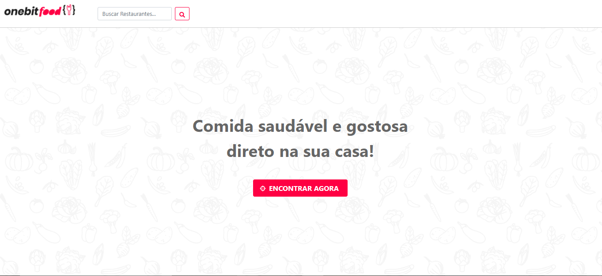

<h1 align='center'>OnebitFood</h1>

<p align='center'>Um app baseado na arquitetura do ifood</p>



## 🛠 Tecnologias 

<p>Principais ferramentas que foram usadas na construção do projeto</p>

✔️ Ruby <br>
✔️ Sass <br>
✔️ JSON <br>
✔️ React <br>
✔️ NextJs <br>
✔️ SqlLite <br>
✔️ JavaScript <br>
✔️ Bootstrap 5 <br>

## <h4 align="center"> 
    🚧 OneBitFood 🚀 em construção... 🚧 

## pré-requisito

Antes de começar, você vai precisar ter instalado em sua máquina as seguintes ferramentas: 

Observação¹ : A versão utilizada do ruby: 2.7.0 / rails: 6.0.3.5 / rvm: 1.29.12

Observação² : Recomendado que seja executado no sistema operacional Ubuntu

[Git](https://git-scm.com), [Ruby_On_Rails](https://gorails.com/setup/ubuntu/20.04), [Node.js](https://nodejs.org/en/) e [Yarn](https://classic.yarnpkg.com/en/docs/install/#windows-stable).

Além disso é bom ter um editor para executar o código como [VsCode](https://code.visualstudio.com/download)


### 🎲 Rodando o projeto API

<br>
Observação: Para executar a aplicação será necessário dois terminais abertos, um vai executar a API e o outro irá executar o nosso front-end que irá consumir a nossa API

```bash

#clone este repositório

$ git clone https://github.com/jonatasvenancio167/onebitfood.git

## acesse a pasta do projeto no terminal

$ cd onebitfood

## execute a aplicação em modo de desenvolvimento 

Primeiro terminal rodará a API construido em ruby:

$ rails s

# O projeto rodará na porta:3000, acesse <http://localhost:3000>

```
### 🎲 Rodando o projeto Front-End

```bash
## acesse a pasta do projeto dentro da pasta onebitfood com outro terminal

$ cd onebitfood-client

## instale as dependencias 

$ yarn install

## execute a aplicação em modo de desenvolvimento 

segundo terminal rodará o front construido em NextJs: 

$ yarn dev

# O projeto rodará na porta:3001, acesse <http://localhost:3001>